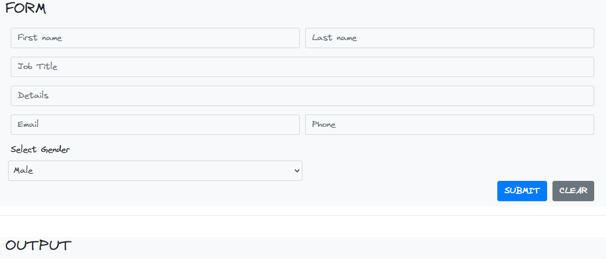
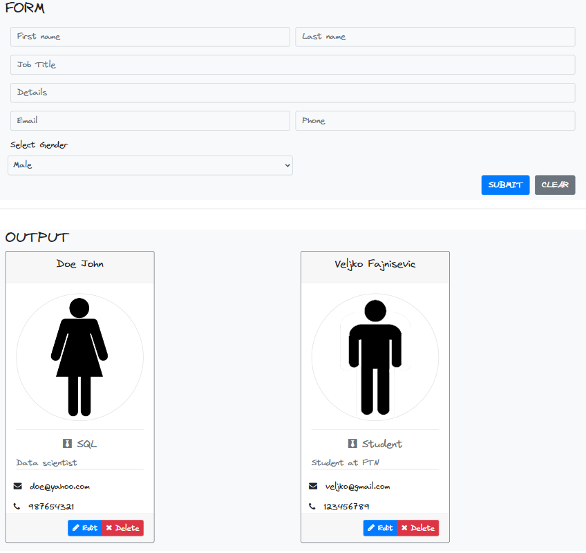

## SMALL PROJECT TO PRACTICE TYPESCRIPT

Work in progress...

Form

    

Person Card

    

Cards are created by inserting a html code from _CardTemplate.ts_. 

#### TO DO

Add functionallity for _Edit_ and _Delete_ buttons on cards.

